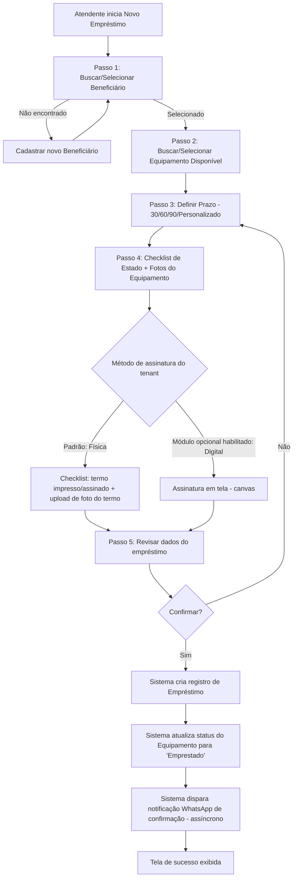
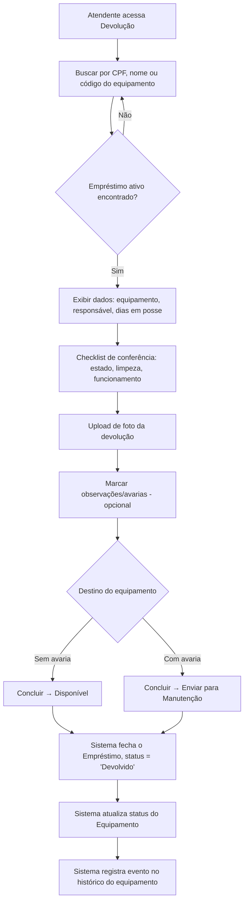
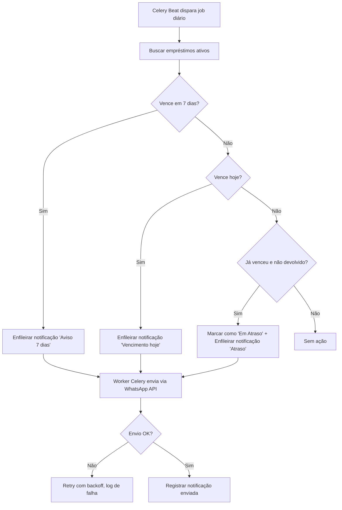
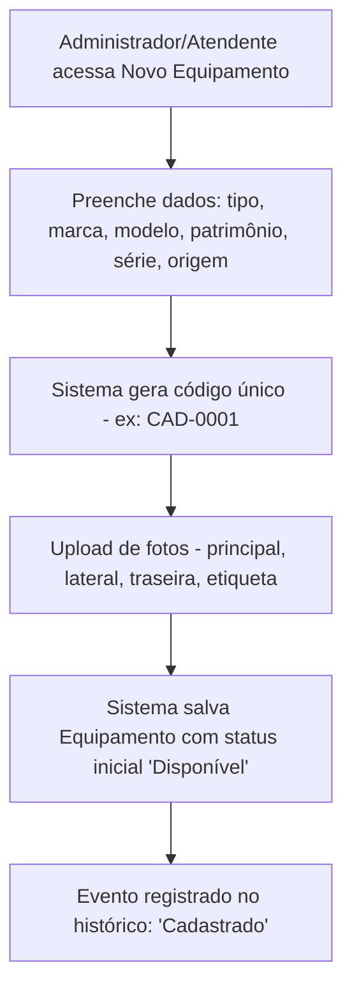

# Especificação Técnica e Arquitetural
## Sistema de Gestão de Empréstimo de Equipamentos Ortopédicos (Tec Assistiva)

**Versão:** 1.1
**Data:** 28/07/2026
**Autor:** Engenharia de Software
**Status:** Draft para aprovação

**Changelog v1.1:** assinatura do termo passa a ser **física por padrão** (checklist de confirmação + foto do termo assinado), com assinatura digital em tela tratada como **módulo opcional** configurável por tenant no painel admin (RF007, RF025, RF026); sistema redesenhado como **multi-tenant** (RF027, RF028, RNF017, RNF018, seção 3.3).

---

## 1. Visão Geral do Sistema

### 1.1 Objetivo

O **Tec Assistiva** é um sistema de gestão (CRM operacional) para controle do ciclo de vida de equipamentos ortopédicos e assistivos (cadeiras de rodas, muletas, andadores, cadeiras de banho, etc.) emprestados pela Secretaria de Assistência Social de um município a beneficiários cadastrados.

O sistema resolve os seguintes problemas hoje geridos manualmente (planilhas, papel, controle informal):

- Falta de rastreabilidade de **onde está cada equipamento** e **com quem**.
- Ausência de controle de **prazos de devolução**, gerando atrasos não identificados.
- Falta de histórico de **manutenção** e **avarias** por equipamento.
- Ausência de **evidência fotográfica** do estado do equipamento na entrega e na devolução (fonte de disputas).
- Falta de **notificação proativa** ao beneficiário (vencimento próximo, atraso).
- Ausência de **indicadores gerenciais** (taxa de ocupação, tempo médio de empréstimo, índice de avarias) para tomada de decisão e prestação de contas pública.

**Escopo desta versão (MVP):**
- Cadastro de equipamentos e beneficiários.
- Processo de empréstimo (wizard guiado) e devolução, com checklist e assinatura física do termo (foto/upload).
- Gestão de manutenção.
- Dashboard operacional e relatórios/indicadores.
- Notificações automáticas (WhatsApp) de eventos do empréstimo.
- Controle de acesso por perfil (Administrador, Atendente, Gestor, Manutenção).
- Leitura de QR Code para identificação rápida do equipamento.
- **Multi-tenant**: um único sistema atende múltiplas instituições (secretarias/prefeituras) de forma isolada entre si.

**Fora de escopo (versões futuras):** integração com sistemas de prontuário eletrônico de saúde, emissão de nota fiscal/compra, app mobile nativo (será PWA/responsivo via web). A **assinatura digital em tela (canvas)** não faz parte do fluxo padrão — é tratada como **módulo adicional opcional**, ativável por tenant (ver RF007 e RF025).

### 1.2 Público-alvo

| Perfil | Descrição | Uso principal |
|---|---|---|
| **Atendente** | Servidor(a) que atende o beneficiário no balcão | Registrar empréstimos, devoluções, cadastrar beneficiários |
| **Gestor** | Coordenador(a) da secretaria/programa | Acompanhar indicadores, relatórios, aprovar renovações |
| **Manutenção** | Responsável técnico/oficina | Registrar entrada/saída de equipamentos em conserto |
| **Administrador** | TI / gestão do sistema | Configurações, usuários, permissões, parametrização |
| **Beneficiário** (indireto, não faz login) | Cidadão que recebe o equipamento | Recebe notificações via WhatsApp |

---

## 2. Requisitos do Sistema

### 2.1 Requisitos Funcionais (RF)

| ID | Nome | Descrição | Prioridade |
|---|---|---|---|
| RF001 | Cadastro de Equipamentos | CRUD de equipamentos com código, tipo, marca, modelo, nº patrimonial, nº de série, origem (compra/doação), tamanho, peso suportado, observações | Alta |
| RF002 | Upload de Fotos do Equipamento | Registrar fotos (principal, lateral, traseira, etiqueta de patrimônio) vinculadas ao equipamento | Alta |
| RF003 | Cadastro de Beneficiários | CRUD com dados pessoais, contato, endereço, contato de emergência, documentos anexados | Alta |
| RF004 | Busca e Filtro de Equipamentos | Busca por código/tipo/marca e filtro por categoria e status | Alta |
| RF005 | Busca de Beneficiários | Busca por nome, CPF ou telefone | Alta |
| RF006 | Wizard de Novo Empréstimo | Fluxo guiado: seleção do beneficiário → seleção do equipamento disponível → definição de prazo → checklist de estado + fotos → assinatura do termo → confirmação | Alta |
| RF007 | Assinatura do Termo de Responsabilidade (Física) | Padrão do sistema: termo impresso, assinado fisicamente pelo beneficiário e registrado via checklist de confirmação ("termo impresso", "termo assinado", "termo anexado/digitalizado") + upload de foto/scan do termo assinado. Não depende de assinatura em tela | Alta |
| RF025 | Módulo Opcional de Assinatura Digital | Módulo adicional (desativado por padrão) que habilita assinatura em tela (canvas) como alternativa à assinatura física, para tenants que optarem por essa modalidade | Baixa |
| RF026 | Configuração do Método de Assinatura | Painel administrativo permite, por tenant, escolher o método de assinatura vigente (Física/checklist — padrão, ou Digital — se módulo habilitado) | Alta |
| RF008 | Registro de Devolução | Busca do empréstimo ativo, checklist de conferência, foto de devolução, marcação de avarias, decisão de destino (disponível/manutenção) | Alta |
| RF009 | Renovação de Empréstimo | Estender prazo de um empréstimo ativo, com aprovação de gestor quando aplicável | Média |
| RF010 | Gestão de Manutenção | Registrar entrada de equipamento em manutenção (problema, fornecedor, valor, responsável), acompanhar status e concluir | Alta |
| RF011 | Histórico do Equipamento | Linha do tempo de eventos (empréstimo, devolução, manutenção, baixa) por equipamento | Alta |
| RF012 | Histórico do Beneficiário | Lista de empréstimos anteriores e situação (sem atraso, renovou, atrasado) | Alta |
| RF013 | Dashboard Operacional | Indicadores em tempo real: disponíveis, emprestados, em manutenção, em atraso, taxa de utilização; gráficos de empréstimos por mês e por tipo | Alta |
| RF014 | Agenda de Devoluções | Visão consolidada de devoluções do dia, vencimentos nos próximos 7 dias e itens em atraso | Alta |
| RF015 | Relatórios Gerenciais | Relatórios segmentados (equipamentos, pessoas, empréstimos, KPIs) com filtros por período/tipo/funcionário/situação | Média |
| RF016 | Notificações Automáticas via WhatsApp | Disparo automático de mensagens: confirmação de empréstimo, aviso 7 dias antes do vencimento, aviso no vencimento, aviso de atraso | Alta |
| RF017 | Templates de Notificação | Cadastro/edição dos textos-modelo usados nas notificações automáticas | Baixa |
| RF018 | Leitura de QR Code | Escaneamento do QR Code do equipamento (via câmera do navegador) para abrir ficha ou iniciar devolução rapidamente | Média |
| RF019 | Controle de Acesso por Perfil (RBAC) | Perfis com permissões distintas (matriz de permissões) sobre cadastro, operação, manutenção, relatórios e configurações | Alta |
| RF020 | Gestão de Usuários | CRUD de usuários do sistema e atribuição de perfil | Alta |
| RF021 | Configurações da Instituição (Tenant) | Cadastro de dados da secretaria/prefeitura (tenant), credenciais de integração (ex: WhatsApp Business) e parametrizações específicas (ex.: método de assinatura — RF026) | Média |
| RF022 | Baixa de Equipamento | Marcar equipamento como baixado (inservível) com justificativa, removendo-o da disponibilidade | Média |
| RF023 | Auditoria de Ações | Registro de quem realizou cada ação crítica (empréstimo, devolução, edição de cadastro) e quando | Média |
| RF024 | Exportação de Relatórios | Exportar relatórios em CSV/PDF | Baixa |
| RF027 | Gestão Multi-tenant (Provisionamento) | Um superadministrador da plataforma cadastra/ativa/desativa tenants (instituições clientes), cada um com seus próprios usuários, equipamentos, beneficiários e configurações, totalmente isolados dos demais | Alta |
| RF028 | Isolamento de Dados entre Tenants | Nenhum usuário de um tenant pode visualizar, buscar ou referenciar dados (equipamentos, beneficiários, empréstimos, relatórios) de outro tenant, em nenhuma tela ou endpoint | Alta |

### 2.2 Requisitos Não Funcionais (RNF)

| ID | Categoria | Descrição |
|---|---|---|
| RNF001 | Desempenho | Páginas de listagem devem responder em até 500ms (p95) para até 5.000 equipamentos e 10.000 beneficiários |
| RNF002 | Escalabilidade | Arquitetura deve suportar crescimento horizontal do backend (stateless) sem alteração estrutural |
| RNF003 | Disponibilidade | SLA alvo de 99,5% em horário comercial (8h–18h, dias úteis), com backup diário do banco de dados |
| RNF004 | Segurança — Autenticação | Autenticação obrigatória para todas as rotas exceto login; sessões com expiração configurável |
| RNF005 | Segurança — Autorização | Controle de acesso baseado em papéis (RBAC) aplicado em nível de view e de objeto quando necessário |
| RNF006 | Segurança — Dados Pessoais (LGPD) | Dados de beneficiários (CPF, endereço, contato de emergência) tratados conforme LGPD: minimização, finalidade, log de acesso e possibilidade de anonimização/exclusão mediante solicitação |
| RNF007 | Segurança — Transporte | Toda comunicação via HTTPS/TLS 1.2+; cookies com flags `Secure`, `HttpOnly`, `SameSite` |
| RNF008 | Segurança — Armazenamento de arquivos | Fotos e documentos armazenados em storage com controle de acesso (não públicos por padrão), URLs assinadas com expiração |
| RNF009 | Usabilidade | Interface responsiva (desktop e mobile), fluxos críticos (empréstimo/devolução) completáveis em até 3 minutos por um atendente treinado |
| RNF010 | Acessibilidade | Conformidade mínima com WCAG 2.1 nível AA nas telas principais (contraste, navegação por teclado, labels) |
| RNF011 | Auditabilidade | Toda alteração em registros críticos (equipamento, empréstimo, beneficiário) deve gerar log imutável com usuário, timestamp e diff |
| RNF012 | Observabilidade | Logs estruturados, métricas de aplicação e alertas configuráveis para erros 5xx e falhas de integração (WhatsApp) |
| RNF013 | Manutenibilidade | Cobertura de testes automatizados mínima de 70% nas camadas de domínio (models/services) |
| RNF014 | Compatibilidade | Suporte aos navegadores Chrome, Edge e Safari nas duas últimas versões principais |
| RNF015 | Portabilidade de dados | Exportação de dados em formato aberto (CSV) disponível a qualquer momento para os módulos principais |
| RNF016 | Resiliência de integrações | Falhas na API de WhatsApp não devem bloquear a operação principal (empréstimo/devolução); reprocessamento assíncrono com retry e backoff |
| RNF017 | Isolamento Multi-tenant | Toda query de leitura/escrita deve ser automaticamente restrita ao tenant do usuário autenticado; falha de isolamento é tratada como incidente de segurança crítico (P0) |
| RNF018 | Escalabilidade Multi-tenant | Onboarding de um novo tenant não deve exigir deploy de nova infraestrutura nem alteração de código — apenas criação de registro de tenant e usuário administrador inicial |

---

## 3. Arquitetura e Tecnologia

### 3.1 Stack Tecnológica

| Camada | Escolha | Justificativa |
|---|---|---|
| **Backend** | Django 5.x + Django REST Framework | Framework maduro, "baterias inclusas" (ORM, admin, auth, permissões, migrations), acelera fortemente um domínio CRUD-intensivo como este. O Django Admin cobre grande parte das necessidades administrativas (RF020, RF021) sem esforço adicional. DRF expõe API para os componentes dinâmicos do front (dashboard, wizard, QR) |
| **Frontend** | Django Templates + HTMX + Alpine.js + Chart.js | Evita a complexidade de manter um SPA separado (build, CORS, autenticação duplicada). HTMX cobre as interações parciais (wizard, filtros, painel lateral) e Alpine cobre estado local de UI (checklists, toggles). Chart.js para os gráficos do dashboard. Biblioteca `html5-qrcode` (JS, via câmera) para RF018 |
| **Banco de Dados** | PostgreSQL 15+ (relacional) | O domínio é fortemente relacional (equipamentos, beneficiários, empréstimos, manutenções com integridade referencial e transações — ex.: não permitir dois empréstimos ativos para o mesmo equipamento). Suporte nativo a JSONField para dados semi-estruturados (ex. checklist), full-text search para buscas (RF004/RF005), e é a opção padrão e mais robusta no ecossistema Django |
| **Cache / Fila** | Redis + Celery | Redis como cache de sessão/consultas e broker do Celery. Celery para tarefas assíncronas: envio de notificações WhatsApp (RNF016), geração de relatórios pesados (RF024), jobs agendados (Celery Beat) para verificação diária de vencimentos/atrasos |
| **Armazenamento de arquivos** | S3-compatível (ex. AWS S3 / MinIO) via `django-storages` | Fotos e documentos não devem ficar no filesystem do servidor de aplicação (não escala horizontalmente, sem durabilidade garantida). URLs assinadas atendem RNF008 |
| **Infraestrutura/Cloud** | Contêineres Docker + orquestração gerenciada (ex. AWS ECS/Fargate ou equivalente) atrás de um Load Balancer, banco gerenciado (RDS PostgreSQL) | Reduz esforço operacional (patch, backup, HA) mantendo controle de custo para uma prefeitura; Fargate evita gestão de servidores; RDS oferece backup automatizado (RNF003) |
| **Integração WhatsApp** | WhatsApp Business API (via provedor homologado, ex. Meta Cloud API ou Twilio) | Requisito explícito do protótipo (RF016); provedor homologado garante conformidade com política do WhatsApp e templates aprovados |
| **CI/CD** | GitHub Actions | Repositório já hospedado no GitHub; pipelines de lint, testes e deploy automatizado |

### 3.2 Padrão Arquitetural

**Escolha: Monólito modular (Django apps) com Arquitetura em Camadas orientada a domínio (inspirada em Clean Architecture, sem over-engineering).**

Justificativa:

- **Não a Microserviços:** o domínio é coeso (um único contexto: gestão de empréstimo de equipamentos), a equipe é pequena/média e o volume de dados é modesto (milhares, não milhões, de registros). Microserviços introduziriam custo operacional (orquestração, observabilidade distribuída, latência de rede) sem benefício real neste estágio.
- **Monólito modular:** o sistema é dividido em **apps Django por domínio** (`equipamentos`, `beneficiarios`, `emprestimos`, `manutencao`, `notificacoes`, `relatorios`, `contas`/`usuarios`), cada um com seus próprios models, services, views e testes. Isso garante organização e possibilita extração futura para serviços independentes caso o volume justifique.
- **Separação em camadas dentro de cada app:**
  - `models.py` — entidades e regras de integridade de dados.
  - `services.py` — regras de negócio e casos de uso (ex.: `criar_emprestimo()`, `registrar_devolucao()`), mantendo as views "magras".
  - `views.py` / `api/` — camada de apresentação (HTML via HTMX e endpoints DRF).
  - `tasks.py` — tarefas assíncronas (Celery).
  - `selectors.py` — consultas de leitura complexas isoladas da lógica de escrita.
- Essa organização evita "fat models"/"fat views" e mantém a lógica de negócio testável de forma isolada do framework web, sem pagar o custo de uma Clean Architecture completa (múltiplas camadas de interfaces/adapters), que seria desproporcional ao tamanho do projeto.
- **Serverless não se aplica** bem aqui devido à necessidade de conexões persistentes ao banco, jobs agendados (Celery Beat) e ao perfil de carga constante (uso interno em horário comercial), onde o custo de cold start e a complexidade de configuração superariam os benefícios.

### 3.3 Estratégia Multi-tenant

**Escolha: Multi-tenancy em banco/schema compartilhado, com discriminação por `tenant_id` (shared database, shared schema, row-level isolation).**

Como funciona:

- Existe uma entidade `Tenant` (a instituição/secretaria/prefeitura cliente). Todo model de domínio (`Equipamento`, `Beneficiario`, `Emprestimo`, `Manutencao`, `NotificacaoTemplate`, `EventoHistorico`, etc.) possui uma FK obrigatória `tenant`.
- Um `TenantMiddleware` resolve o tenant do usuário autenticado (1 usuário pertence a exatamente 1 tenant, exceto o superadministrador da plataforma) e injeta esse contexto na *request*.
- Um `Manager`/`QuerySet` customizado (`TenantManager`) filtra **automaticamente** por `tenant_id` em toda consulta ORM, evitando que um desenvolvedor esqueça o filtro em uma view específica — o isolamento é a regra, não a exceção (atende RF028/RNF017).
- Constraints de unicidade (ex.: `codigo` do equipamento, `cpf` do beneficiário) são compostas com `tenant_id` (`unique_together`), permitindo que dois tenants tenham, por exemplo, o mesmo código de equipamento sem conflito.
- Django Admin usa um `TenantAdminMixin` que restringe listagens/edições ao tenant do usuário logado (exceto para o superadministrador da plataforma, que enxerga todos para fins de suporte/provisionamento — RF027).

Justificativa da escolha (vs. alternativas):

| Estratégia | Isolamento | Custo operacional | Onboarding de tenant | Escolha |
|---|---|---|---|---|
| **Banco/schema compartilhado + `tenant_id`** (escolhida) | Bom (aplicado por middleware/manager, reforçado por testes automatizados) | Baixo — uma única infraestrutura, um único deploy | Instantâneo (RNF018) — criar registro de `Tenant` | ✅ |
| Schema-per-tenant (ex. `django-tenants`) | Muito forte (isolamento físico por schema PostgreSQL) | Alto — migrations rodam por schema, backups/restore mais complexos, dificulta queries agregadas entre tenants para o time da plataforma | Requer criação de schema + migração por tenant | Alternativa para o futuro, se exigências contratuais de isolamento físico (ex. cliente que exige banco dedicado) surgirem |
| Banco dedicado por tenant | Máximo | Muito alto — 1 banco por prefeitura, escala mal para dezenas/centenas de municípios pequenos | Requer provisionamento de infraestrutura | Descartada para o MVP; viável apenas para grandes clientes que paguem por isolamento dedicado |

Dado o perfil esperado (múltiplas secretarias/prefeituras de porte pequeno/médio, orçamento público limitado, volume de dados modesto por tenant), a opção de **schema compartilhado com `tenant_id`** oferece o melhor equilíbrio entre isolamento adequado, custo de operação e velocidade de onboarding. A arquitetura em camadas (services/selectors) já isola o acesso a dados, o que facilita migrar para `django-tenants` (schema-per-tenant) no futuro caso um cliente específico exija isolamento físico, sem redesenhar o domínio.

---

## 4. Modelagem e Fluxos

### 4.1 Fluxograma de Processos (descrição textual para Mermaid)

#### Fluxo 1 — Novo Empréstimo (RF006)

#### Fluxo 2 — Devolução (RF008)

#### Fluxo 3 — Verificação Diária de Vencimentos (job assíncrono, suporta RF016)

#### Fluxo 4 — Cadastro de Equipamento (RF001/RF002)

### 4.2 Modelagem de Dados

> **Nota sobre multi-tenancy:** todas as entidades de domínio abaixo (exceto `Tenant` em si) possuem uma FK obrigatória `tenant` (omitida individualmente por brevidade, indicada uma única vez aqui). Campos que hoje são `único` (ex. `codigo` do equipamento, `cpf` do beneficiário) passam a ser únicos **por tenant** (`unique_together = ('tenant', 'campo')`).

#### Entidades principais e atributos

- **Tenant** (instituição cliente da plataforma — ex. Secretaria de Assistência Social de um município)
  - id, nome, slug (identificador único usado em URL/subdomínio), whatsapp_business_numero, credenciais_api (armazenamento seguro), assinatura_metodo (`fisica` [padrão] / `digital`), modulo_assinatura_digital_habilitado (bool), ativo, criado_em

- **Usuario** (extensão do `auth.User` do Django, ou model `Perfil` 1:1)
  - id, tenant (FK, nulo apenas para superadministrador da plataforma), username, email, senha (hash), nome_completo, perfil (FK Papel), ativo, data_criacao

- **Papel/Perfil** (RBAC — Administrador, Atendente, Gestor, Manutenção)
  - id, nome, permissões (via `django.contrib.auth.Group` + `Permission`)

- **Beneficiario** — *(tenant)*
  - id, nome, cpf (único por tenant), rg, data_nascimento, telefone, whatsapp, email, endereco, cidade, bairro, cep, contato_emergencia_nome, contato_emergencia_telefone, contato_emergencia_parentesco, status (ativo/com_emprestimo/em_atraso), criado_em, atualizado_em

- **DocumentoBeneficiario** — *(tenant)*
  - id, beneficiario (FK), tipo (RG/CPF/Comprovante/Receita/Laudo), arquivo, enviado_em

- **CategoriaEquipamento** — *(tenant)*
  - id, nome (Cadeira de Rodas, Muletas, Andador, Cadeira de Banho, ...)

- **Equipamento** — *(tenant)*
  - id, codigo (único por tenant, gerado por categoria), categoria (FK), marca, modelo, patrimonio, numero_serie, data_aquisicao, origem (compra/doação), tamanho, peso_suportado, observacoes, status (disponivel/emprestado/manutencao/baixado), qr_code_token (único), criado_em

- **FotoEquipamento** — *(tenant)*
  - id, equipamento (FK), tipo (principal/lateral/traseira/etiqueta), arquivo, enviado_em

- **Emprestimo** — *(tenant)*
  - id, equipamento (FK), beneficiario (FK), atendente (FK Usuario), data_retirada, prazo_dias, data_prevista_devolucao, data_devolucao_real (nullable), status (ativo/devolvido/atrasado/renovado), assinatura_tipo (`fisica` [padrão] / `digital`, definido pela configuração do tenant no momento do empréstimo), assinatura_arquivo (foto/scan do termo assinado — obrigatório no modo físico), assinatura_canvas_dados (nullable, usado somente quando o módulo digital está habilitado), checklist_retirada (JSONField, inclui itens de confirmação do termo físico: "termo impresso", "termo assinado", "termo anexado"), criado_em

- **FotoEmprestimo** — *(tenant)*
  - id, emprestimo (FK), momento (retirada/devolucao), tipo (frontal/lateral/detalhe), arquivo

- **Renovacao** — *(tenant)*
  - id, emprestimo (FK), nova_data_devolucao, aprovado_por (FK Usuario, nullable), solicitado_em, status (pendente/aprovado/negado)

- **Devolucao** — *(tenant)*
  - id, emprestimo (FK, 1:1), atendente (FK Usuario), checklist_devolucao (JSONField), avarias (JSONField ou M2M com `TipoAvaria`), destino (disponivel/manutencao), foto, criado_em

- **Manutencao** — *(tenant)*
  - id, equipamento (FK), problema, fornecedor, responsavel (FK Usuario), valor, data_entrada, data_conclusao (nullable), status (aguardando/concluido)

- **EventoHistorico** — *(tenant)* (log de auditoria / timeline por equipamento — RF011/RF023)
  - id, equipamento (FK, nullable), beneficiario (FK, nullable), tipo_evento, descricao, usuario (FK), criado_em

- **NotificacaoTemplate** — *(tenant)*
  - id, tipo (confirmacao/aviso_7dias/vencimento/atraso), titulo, corpo_texto

- **NotificacaoEnviada** — *(tenant)*
  - id, emprestimo (FK), template (FK), destinatario_telefone, status_envio (pendente/enviado/falhou), tentativas, enviado_em

#### Relacionamentos

- `Tenant` **1:N** de praticamente todas as entidades de domínio abaixo (isolamento multi-tenant)
- `Tenant` **1:N** `Usuario`
- `CategoriaEquipamento` **1:N** `Equipamento`
- `Equipamento` **1:N** `FotoEquipamento`
- `Equipamento` **1:N** `Emprestimo` (histórico); porém **regra de negócio**: no máximo 1 `Emprestimo` com `status=ativo` por equipamento (constraint de aplicação + índice único parcial)
- `Beneficiario` **1:N** `Emprestimo`
- `Beneficiario` **1:N** `DocumentoBeneficiario`
- `Emprestimo` **1:1** `Devolucao`
- `Emprestimo` **1:N** `Renovacao`
- `Emprestimo` **1:N** `FotoEmprestimo`
- `Emprestimo` **1:N** `NotificacaoEnviada`
- `Equipamento` **1:N** `Manutencao`
- `Usuario` **N:1** `Papel` (ou **N:N** via `Group` padrão do Django)
- `Equipamento`/`Beneficiario` **1:N** `EventoHistorico` (polimórfico simples, campos nullable)
- `NotificacaoTemplate` **1:N** `NotificacaoEnviada`

---

## 5. Segurança e Monitoramento

### 5.1 Autenticação

- **Estratégia:** autenticação baseada em **sessão do Django** para o front server-rendered (cookies `HttpOnly` + `Secure` + `SameSite=Lax`), adequada ao uso interno via navegador.
- Para eventuais integrações externas (app mobile futuro, integrações de terceiros), expor autenticação via **JWT** (usando `djangorestframework-simplejwt`) na API DRF, mantida em paralelo à sessão.
- **MFA (autenticação em dois fatores)** obrigatório para perfis `Administrador` e `Gestor`, via TOTP (ex. `django-otp`), dado o acesso a dados pessoais sensíveis (LGPD) e configurações críticas.
- **OAuth2** não é prioritário no MVP (não há necessidade de login social ou integração com IdP externo), mas a stack (Django) permite adicionar `django-allauth`/`django-oauth-toolkit` se a prefeitura exigir SSO corporativo futuramente.
- Política de senha forte, bloqueio por tentativas (`django-axes`) e expiração de sessão por inatividade (RNF004).

### 5.2 Autorização

- RBAC via `django.contrib.auth.Group`/`Permission`, mapeando exatamente a matriz de permissões do protótipo (Administrador, Atendente, Gestor, Manutenção) por app/model (`add_`, `change_`, `view_`, `delete_`).
- Regras adicionais de objeto (ex.: Manutenção só edita registros de manutenção do próprio equipamento) via checagem em `services.py`, não apenas no nível de framework.

### 5.3 Isolamento Multi-tenant

- Todo usuário autenticado (exceto o superadministrador da plataforma) está vinculado a exatamente um `Tenant`; o `TenantMiddleware` resolve esse vínculo a cada requisição e o expõe via `request.tenant`.
- Isolamento aplicado em três camadas redundantes (defesa em profundidade): (1) `TenantManager` filtrando automaticamente toda `QuerySet` por `tenant_id`; (2) validação explícita em `services.py` ao criar/editar registros, rejeitando referências cruzadas entre tenants (ex.: criar empréstimo apontando para equipamento de outro tenant); (3) testes automatizados dedicados de isolamento (um teste por endpoint/tela crítica garantindo 404/403 ao tentar acessar recurso de outro tenant).
- Painel administrativo (Django Admin) segrega dados por tenant via `TenantAdminMixin`; apenas o superadministrador da plataforma tem visão cross-tenant, usada exclusivamente para suporte e provisionamento (RF027).
- Qualquer incidente de vazamento de dados entre tenants é tratado como severidade máxima (P0), com log de auditoria (`EventoHistorico`) permitindo reconstruir o acesso indevido.

### 5.4 Proteção de dados (LGPD)

- Dados sensíveis de beneficiários criptografados em repouso quando aplicável (ex. CPF com campo indexado por hash + valor cifrado, se exigido pela política interna).
- Log de acesso a dados pessoais (quem visualizou a ficha de qual beneficiário).
- Rotina de anonimização/expurgo mediante solicitação de titular.

### 5.5 Observabilidade

| Camada | Ferramenta | Finalidade |
|---|---|---|
| Logs de aplicação | `structlog` + agregador (ex. CloudWatch Logs / ELK) | Logs estruturados em JSON, correlação por `request_id` |
| Erros/Exceções | Sentry | Captura de exceções não tratadas em produção, com contexto de usuário e request |
| Métricas de infraestrutura | CloudWatch / Prometheus + Grafana | CPU, memória, latência, taxa de erro 5xx, filas Celery |
| Métricas de negócio | Dashboard interno (RF013) + export para BI, se necessário | Taxa de ocupação, atrasos, tempo médio de manutenção |
| Alertas | Alertmanager / CloudWatch Alarms → e-mail/Slack | Erros 5xx acima do limiar, falha recorrente de envio WhatsApp, fila Celery acumulando |
| Auditoria | `django-simple-history` ou `EventoHistorico` custom | Trilha de auditoria de alterações em models críticos |
| Health checks | Endpoint `/healthz` | Verificação de banco, Redis e broker Celery para orquestrador |

---

## 6. Próximos Passos Sugeridos

1. Validar esta especificação com os stakeholders da Secretaria (nomenclatura de perfis, regras de renovação, política de LGPD).
2. Detalhar contratos de API (OpenAPI/Swagger) para os endpoints DRF usados pelo HTMX.
3. Criar o esqueleto do projeto Django (apps, models, migrations iniciais, admin básico).
4. Definir ambiente de desenvolvimento (Docker Compose: web, db, redis, worker) e pipeline de CI.
