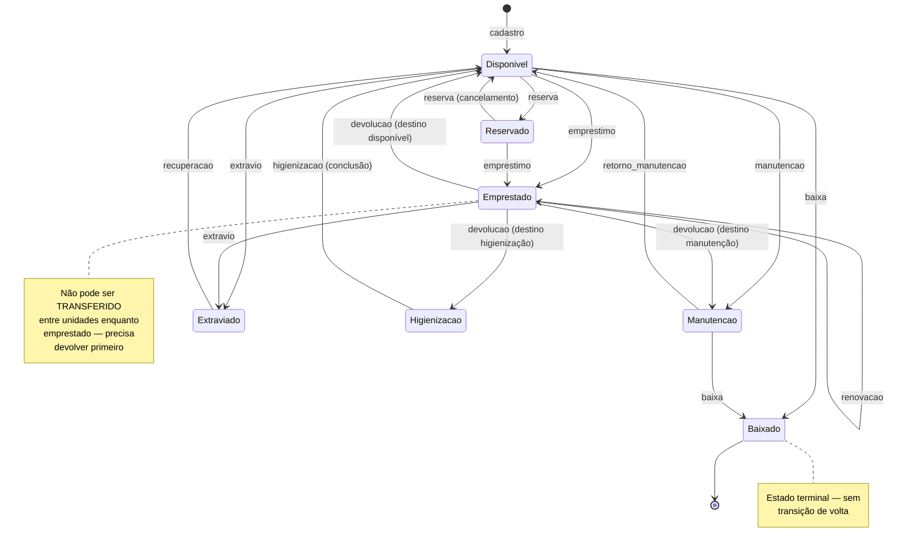
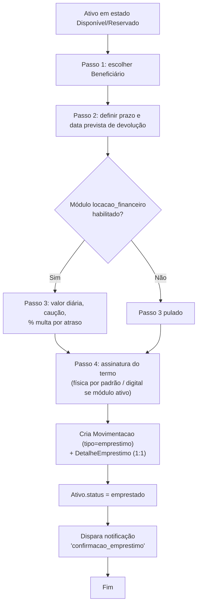
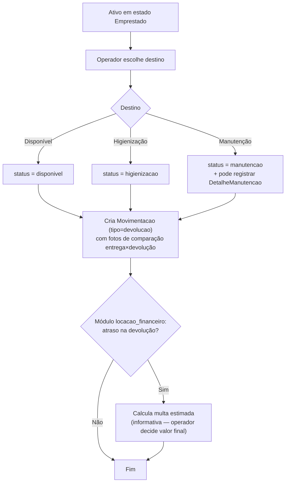
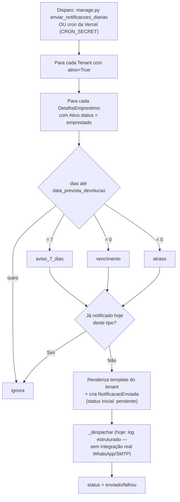
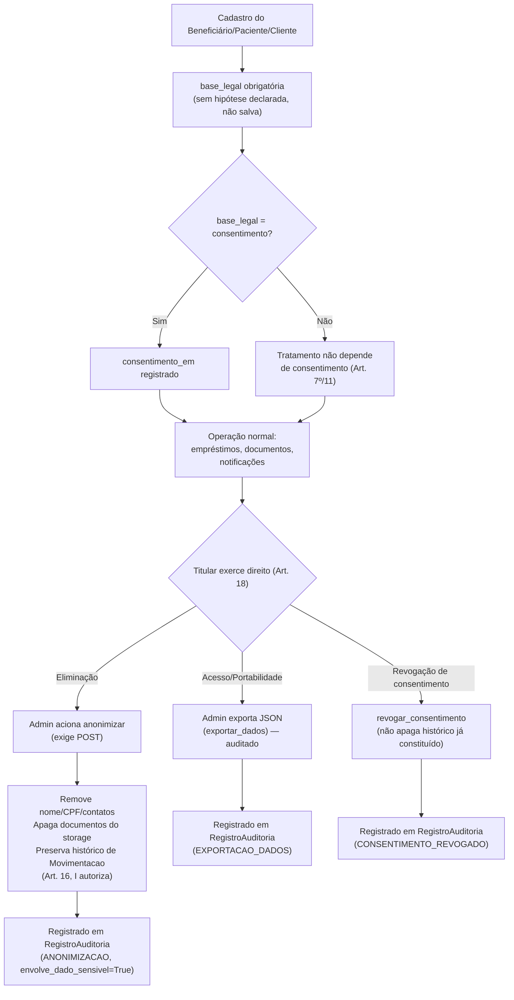
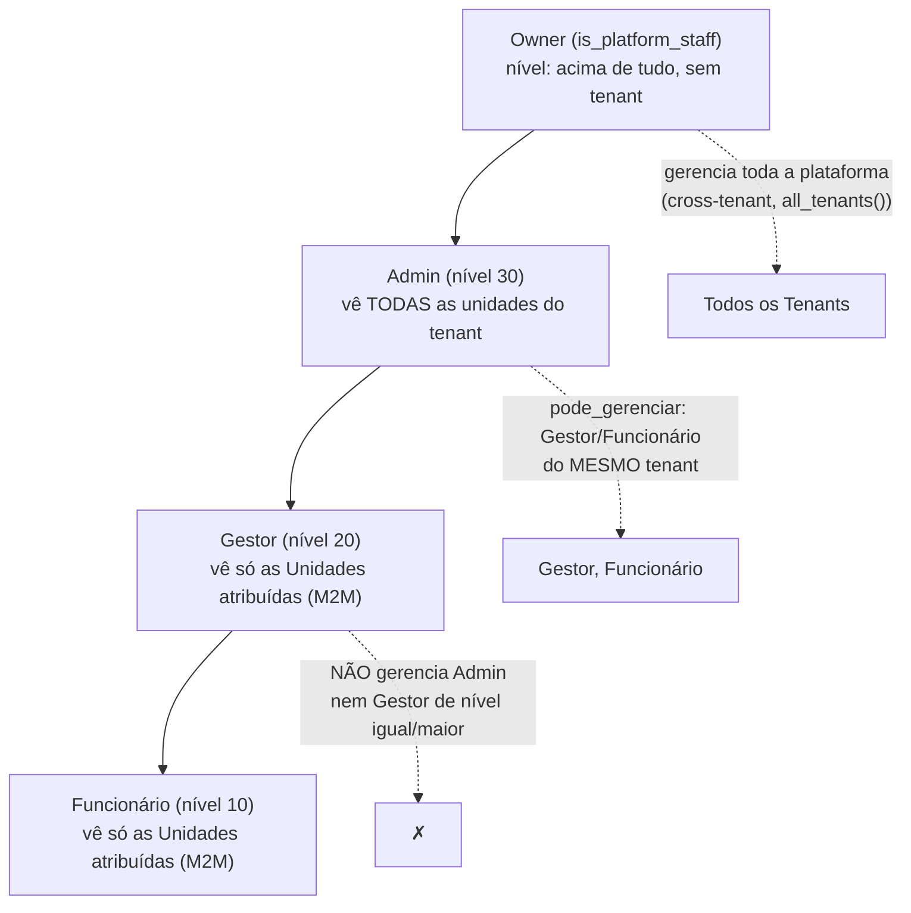
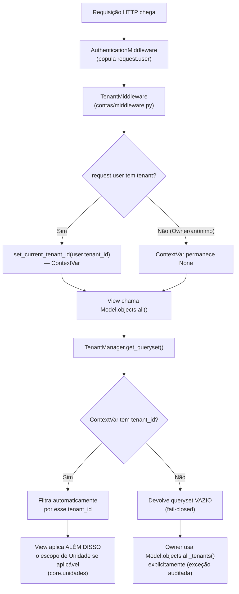

# Fluxos de Negócio

Diagramas dos principais fluxos operacionais da plataforma. Fonte de
verdade do comportamento é sempre o código citado junto a cada diagrama —
estes fluxos são uma representação visual para orientação rápida, não uma
especificação normativa por si mesmos.

## 1. Máquina de estados do Ativo

Fonte: `ativos/domain/state_machine.py` (`_TRANSICOES_SIMPLES` +
`_TRANSICOES_COM_DESTINO`), detalhada em `docs/PLANO_DOMINIO_ATIVOS.md §5.2`.

**Transferência entre unidades** não muda o estado operacional — é
permitida a partir de `Disponivel`, `Reservado`, `Manutencao` e
`Higienizacao` (não a partir de `Emprestado`, `Baixado`, `Extraviado` ou
`Inativo`), e o estado se mantém igual (só muda `unidade` responsável).

**Inativação administrativa** (`Disponivel`/`Manutencao`/`Reservado` →
`Inativo`) não é disparada por um tipo de `Movimentacao` do fluxo
operacional — é uma ação administrativa separada (`pode_inativar` em
`state_machine.py`).

## 2. Fluxo de Empréstimo (wizard de 4 passos)

Fonte: `ativos/services.py`, `docs/business-rules/emprestimos.md`.

## 3. Fluxo de Devolução

## 4. Job diário de notificações (vencimento/atraso)

Fonte: `notificacoes/jobs.py::executar_verificacao_diaria`.

## 5. Ciclo de vida de um titular sob a LGPD

Fonte: `beneficiarios/lgpd.py`, `README.md §"Direitos do titular"`.

## 6. Hierarquia de papéis e escopo de visibilidade

Fonte: `contas/models.py`, `core/unidades.py`, `ativos/domain/acoes.py`.

Regra de gestão de usuário: `Usuario.pode_gerenciar(outro)` exige mesmo
`tenant` e `nivel_hierarquico` de quem gerencia ≥ nível de quem é
gerenciado. Owner ignora tudo isso (gerencia a plataforma inteira).

## 7. Isolamento multi-tenant — onde a decisão acontece

## Onde encontrar as fontes destes diagramas

| Diagrama | Fonte de verdade no código |
|---|---|
| Máquina de estados | `ativos/domain/state_machine.py`, testado em `ativos/tests/test_state_machine.py` |
| Empréstimo/Devolução | `ativos/services.py`, `ativos/views.py` (wizard) |
| Notificações diárias | `notificacoes/jobs.py`, `notificacoes/services.py` |
| Direitos LGPD | `beneficiarios/lgpd.py`, testado em `beneficiarios/tests/test_lgpd.py` |
| Hierarquia/RBAC | `contas/models.py::Usuario.pode_gerenciar`, `ativos/domain/acoes.py` |
| Isolamento multi-tenant | `core/tenancy.py`, `core/models.py::TenantManager`, `contas/middleware.py` |
