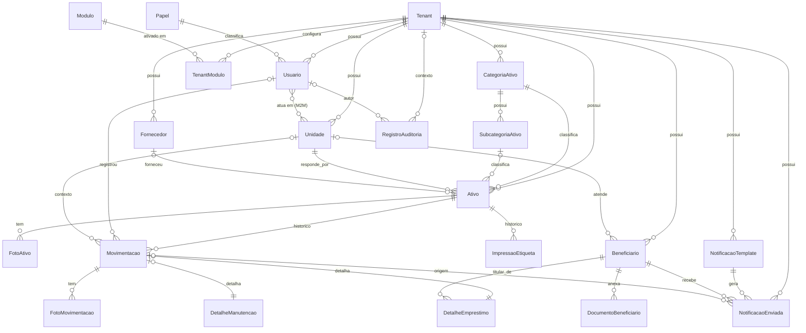

# Referência de Banco de Dados

PostgreSQL 16. Schema gerenciado inteiramente por migrations do Django
(`python manage.py migrate` / `makemigrations`) — não editar tabela
diretamente em produção fora desse fluxo. Em produção o schema já está
aplicado no Supabase Postgres (ver `README.md`).

Convenção de nome de tabela do Django: `<app>_<model em minúsculas>` (ex.:
`ativos_ativo`, `beneficiarios_beneficiario`). `TenantModel` (abstrato) não
gera tabela própria — cada model concreto que o herda ganha sua própria
tabela com a coluna `tenant_id`.

## 1. Diagrama de entidades (visão geral)



## 2. Dicionário de tabelas

### `core_tenant`

A instituição cliente (prefeitura, fundo social, home care, locadora,
hospital, ONG). Raiz do isolamento multi-tenant.

| Campo | Tipo | Notas |
|---|---|---|
| `id` | bigint PK | |
| `nome` | varchar(150) | |
| `slug` | varchar(60) | único |
| `segmento` | varchar(20) | `fundo_social`/`home_care`/`locadora`/`hospital`/`ong` — define rótulo de vocabulário e padrão de módulo |
| `cidade`, `uf` | varchar | |
| `ativo` | boolean | contrato suspenso/reativado pela tela do Owner |
| `criado_em` | timestamptz | |

### `core_unidade`

Unidade física de um tenant (posto, filial, loja). `TenantModel`.

| Campo | Tipo | Notas |
|---|---|---|
| `tenant_id` | FK → `core_tenant` | `on_delete=CASCADE` |
| `nome` | varchar(150) | único por tenant |
| `tipo`, `responsavel`, `telefone`, `email`, `endereco`, `cidade`, `uf`, `observacoes` | — | texto livre |
| `ativo` | boolean | |

### `core_modulo`

Catálogo global de feature flags (não é `TenantModel` — o mesmo catálogo
vale para todos os tenants). Populado por migration de dados, não por
tela.

| Campo | Tipo | Notas |
|---|---|---|
| `codigo` | slug | único (`locacao_financeiro`, `documento_pessoa_juridica`) |
| `nome`, `descricao` | — | |

### `core_tenantmodulo`

Ativação/desativação explícita de um módulo para um tenant específico —
sobrepõe o padrão do segmento. `TenantModel`.

| Campo | Tipo | Notas |
|---|---|---|
| `tenant_id`, `modulo_id` | FK | par único |
| `ativo` | boolean | |

### `core_fornecedor`

Fornecedor/oficina usado em aquisição e manutenção. `TenantModel`, único
`(tenant, nome)`.

### `contas_papel`

Catálogo global e fixo de papéis (Admin/Gestor/Funcionário) — não é por
tenant.

| Campo | Tipo | Notas |
|---|---|---|
| `codigo` | varchar(20) | único: `admin`/`gestor`/`funcionario` |
| `nome` | varchar(50) | |
| `nivel_hierarquico` | smallint | único; maior número = mais autoridade, usado em `Usuario.pode_gerenciar` |
| `pode_gerenciar_manutencao` | boolean | permissão transversal adicional |

### `contas_usuario`

Estende `AbstractUser` do Django (`AUTH_USER_MODEL`). Cobre tanto
usuários de tenant quanto equipe da plataforma.

| Campo | Tipo | Notas |
|---|---|---|
| ...campos padrão do Django (`username`, `password`, `email`, `is_active`, `last_login`, ...) | | |
| `tenant_id` | FK → `core_tenant`, nullable | `on_delete=PROTECT`; `NULL` só para Owner |
| `is_platform_staff` | boolean | equipe Ciclartech, sem tenant |
| `papel_id` | FK → `contas_papel`, nullable | `on_delete=PROTECT` |
| CHECK `owner_nao_pertence_a_tenant` | | `is_platform_staff=True` ⇒ `tenant_id IS NULL` |

### `contas_usuario_unidades` (tabela M2M)

Unidades que um Gestor/Funcionário pode operar (Admin ignora esta tabela e
vê tudo do tenant — regra aplicada em código, não no banco).

### `ativos_categoriaativo` / `ativos_subcategoriaativo`

Classificação de ativo. `TenantModel`; `Subcategoria` referencia
`Categoria` (`CASCADE`), único `(categoria, nome)`.

`prefixo` em `CategoriaAtivo` gera o código patrimonial automático (ex.:
`CAD-000001`).

### `ativos_ativo`

Aggregate root do domínio de ativos.

| Campo | Tipo | Notas |
|---|---|---|
| `patrimonio` | varchar(50) | único por tenant |
| `qr_token` | varchar(64) | **único globalmente na plataforma** (não por tenant) — permite resolver o ativo a partir da etiqueta física antes de saber o tenant |
| `categoria_id` | FK → `CategoriaAtivo` | `PROTECT` |
| `subcategoria_id` | FK, nullable | `SET_NULL` |
| `status` | varchar(20) | ver enum `StatusAtivo` abaixo |
| `unidade_id` | FK → `Unidade` | **obrigatória**, `PROTECT` — nenhum ativo existe sem unidade |
| `fornecedor_id` | FK, nullable | `SET_NULL` |
| `modelo`, `fabricante`, `numero_serie`, `observacoes` | — | |
| `data_aquisicao`, `vida_util_meses` | — | |
| `criado_em`, `atualizado_em` | timestamptz | |

**`status`** (`ativos.domain.enums.StatusAtivo`): `disponivel`,
`emprestado`, `reservado`, `manutencao`, `higienizacao`, `baixado`,
`extraviado`, `inativo`. Transições válidas: ver
`docs/FLUXOS_DE_NEGOCIO.md` §1 e `ativos/domain/state_machine.py`
(fonte de verdade).

### `ativos_fotoativo`

Fotos de cadastro do ativo (não ligadas a uma movimentação). `TenantModel`,
`CASCADE` em `Ativo`. `tipo`: `principal`/`lateral`/`traseira`/`etiqueta`.

### `ativos_movimentacao`

Registro **imutável** (`delete()` bloqueado no model) de tudo que acontece
com um ativo — fonte de verdade da timeline.

| Campo | Tipo | Notas |
|---|---|---|
| `ativo_id` | FK → `Ativo` | `PROTECT` |
| `tipo` | varchar(20) | ver enum `TipoMovimentacao` abaixo |
| `data_hora` | timestamptz | `auto_now_add` |
| `usuario_id` | FK, nullable | `SET_NULL` |
| `unidade_id` | FK, nullable | `SET_NULL` |
| `status_anterior`, `status_novo` | varchar(20) | snapshot da transição |
| `dados_especificos` | jsonb | payload livre por tipo de movimentação |
| `observacoes` | text | |

**`tipo`** (`TipoMovimentacao`): `emprestimo`, `devolucao`, `renovacao`,
`transferencia`, `reserva`, `manutencao`, `retorno_manutencao`,
`higienizacao`, `baixa`, `extravio`, `recuperacao`.

### `ativos_fotomovimentacao`

Fotos anexadas a uma movimentação (ex.: comparação entrega × devolução).
`TenantModel`, `CASCADE` em `Movimentacao`. `tipo`:
`frontal`/`lateral`/`detalhe`/`etiqueta`.

### `ativos_detalheemprestimo`

Dados específicos de uma `Movimentacao` do tipo `emprestimo` — relação
**1:1** (`OneToOneField`).

| Campo | Tipo | Notas |
|---|---|---|
| `movimentacao_id` | O2O → `Movimentacao` | `CASCADE` |
| `beneficiario_id` | FK → `Beneficiario` | `PROTECT` |
| `prazo_dias`, `data_prevista_devolucao` | — | |
| `assinatura_tipo` | varchar(10) | `fisica` (padrão) / `digital` |
| `assinatura_arquivo` | filefield, nullable | |
| `valor_diaria`, `caucao`, `percentual_multa_atraso_dia` | decimal, nullable | só preenchidos com módulo `locacao_financeiro` habilitado |

### `ativos_layoutetiqueta` (choices, não é tabela própria) / `ativos_impressaoetiqueta`

Histórico **append-only** (`delete()` bloqueado) de impressão de etiqueta.

| Campo | Tipo | Notas |
|---|---|---|
| `ativo_id` | FK → `Ativo` | `CASCADE` |
| `layout` | varchar(10) | `pequeno`/`medio`/`grande` |
| `usuario_id` | FK, nullable | `SET_NULL` |
| `impresso_em` | timestamptz | |
| `lote` | uuid | agrupa etiquetas geradas na mesma folha |

Índice composto `(tenant, lote)`.

### `ativos_detalhemanutencao`

Dados específicos de uma `Movimentacao` do tipo `manutencao` — 1:1.

| Campo | Tipo | Notas |
|---|---|---|
| `movimentacao_id` | O2O → `Movimentacao` | `CASCADE` |
| `fornecedor_id` | FK, nullable | `SET_NULL` |
| `motivo` | varchar(255) | |
| `valor` | decimal, nullable | |
| `data_conclusao` | date, nullable | |

### `beneficiarios_beneficiario`

Pessoa/entidade destinatária do ativo — generalizado via `tipo_relacao`
(beneficiário social / paciente / cliente locatário) em vez de três models
distintos.

| Campo | Tipo | Notas |
|---|---|---|
| `tipo_relacao` | varchar(20) | `beneficiario`/`paciente`/`cliente` — só rótulo, mesma tabela |
| `unidade_id` | FK, nullable | `SET_NULL` — **opcional** (diferente de `Ativo.unidade`); sem unidade fica visível a todo o tenant |
| `tipo_documento` | varchar(4) | `cpf`/`cnpj` — CNPJ só oferecido com módulo `documento_pessoa_juridica` |
| `documento` | varchar(18) | único por tenant; guarda CPF ou CNPJ conforme `tipo_documento` |
| `nome`, `rg`, `data_nascimento`, `telefone`, `whatsapp`, `email`, `endereco`, `cidade`, `bairro`, `cep` | — | |
| `contato_emergencia_*` | — | |
| **LGPD** `base_legal` | varchar(30) | obrigatória — ver `BaseLegal` abaixo |
| `consentimento_em`, `consentimento_revogado_em`, `anonimizado_em` | timestamptz, nullable | |
| `criado_em`, `atualizado_em` | | |

**`base_legal`** (`Beneficiario.BaseLegal`): `consentimento`,
`obrigacao_legal`, `politica_publica`, `tutela_saude`,
`execucao_contrato`.

### `beneficiarios_documentobeneficiario`

Documento anexado (RG, CPF, comprovante de residência, receita médica,
laudo). `TenantModel`, `CASCADE` em `Beneficiario`. Laudo e receita médica
são **dado sensível** (LGPD Art. 5º, II) — ver controles de acesso em
`README.md` §"Segurança e LGPD".

### `notificacoes_notificacaotemplate`

Template editável por tenant (hoje só via Django Admin). Único
`(tenant, tipo)`. `tipo`: `confirmacao_emprestimo`/`aviso_7_dias`/
`vencimento`/`atraso`.

### `notificacoes_notificacaoenviada`

Registro de cada envio (WhatsApp/Email), hoje via backend de log
estruturado (`notificacoes/services.py::_despachar`).

| Campo | Tipo | Notas |
|---|---|---|
| `movimentacao_id` | FK, nullable | `SET_NULL` |
| `beneficiario_id` | FK | `CASCADE` |
| `template_id` | FK | `PROTECT` |
| `canal` | varchar(10) | `whatsapp`/`email` |
| `status` | varchar(10) | `pendente`/`enviado`/`falhou` |
| `tentativas` | int | |
| `destinatario`, `corpo_renderizado` | — | |
| `enviado_em`, `criado_em` | | |

### `auditoria_registroauditoria`

Trilha **append-only** (`save()` de update e `delete()` bloqueados no
model) — LGPD Art. 37 e forense de incidente. **Não** herda `TenantModel**:
`tenant` é FK opcional (`SET_NULL`), porque parte dos eventos mais
importantes (tentativa de login que falhou) acontece antes de haver tenant
no contexto.

| Campo | Tipo | Notas |
|---|---|---|
| `tenant_id` | FK, nullable | `SET_NULL` |
| `usuario_id` | FK, nullable | `SET_NULL` |
| `usuario_identificacao` | varchar(254) | cópia textual, sobrevive à remoção do usuário |
| `acao` | varchar(40) | catálogo fechado — ver `AcaoAuditada` abaixo |
| `objeto_tipo` | varchar(100) | `"app_label.ModelName"`, string (não FK a `ContentType`) |
| `objeto_id` | varchar(64) | |
| `descricao` | varchar(255) | |
| `envolve_dado_sensivel` | boolean | marca acesso a dado de saúde |
| `ip`, `user_agent` | — | |
| `criado_em` | timestamptz | |

Índices: `(-criado_em)`, `(acao, -criado_em)`, `(tenant, -criado_em)`,
`(objeto_tipo, objeto_id)`, `(envolve_dado_sensivel, -criado_em)`.

**`acao`** (`AcaoAuditada`): `login_sucesso`, `login_falha`, `logout`,
`bloqueio_tentativas`, `acesso_negado`, `senha_alterada`,
`senha_reset_solicitado`, `acesso_dado_pessoal`, `criacao`, `alteracao`,
`exclusao`, `exportacao_dados`, `anonimizacao`,
`consentimento_registrado`, `consentimento_revogado`. Retenção padrão 24
meses (`AUDITORIA_RETENCAO_DIAS`), expurgo via `manage.py
expurgar_auditoria`.

## 3. Tabelas append-only (nunca `DELETE`, `save()` de update bloqueado)

| Tabela | Bloqueio |
|---|---|
| `ativos_movimentacao` | `delete()` levanta `RuntimeError` |
| `ativos_impressaoetiqueta` | `delete()` levanta `RuntimeError` |
| `auditoria_registroauditoria` | `save()` de update **e** `delete()` levantam `RuntimeError` |

O bloqueio é hoje só na camada de aplicação (nível de model). A revogação
do privilégio `DELETE`/`UPDATE` a nível de banco de dados (para o usuário
de aplicação, não `postgres`) é uma tarefa de infraestrutura complementar
ainda não realizada — ver `docs/GUIA_OPERACOES.md` §"Hardening pendente".

## 4. Isolamento — como o `tenant_id` é aplicado

Nenhuma tabela usa Row-Level Security do Postgres para isolar por tenant
(RLS no Supabase está ligado, mas **sem policy**, e serve só para bloquear
acesso via API REST do Supabase/PostgREST com a chave `anon` — o Django
conecta como `postgres`, dono das tabelas, com `BYPASSRLS`). O isolamento
real é feito inteiramente na aplicação, pelo `TenantManager` — ver
`docs/GUIA_DESENVOLVEDOR.md` §4. Isso significa que **qualquer acesso
direto ao banco fora do Django** (psql manual, ferramenta de BI, script
ad-hoc) não tem isolamento automático — sempre filtrar por `tenant_id`
manualmente nesses casos.

## 5. Gerando um diagrama a partir do schema real

Para inspecionar o schema efetivamente aplicado (inclui índices e
constraints gerados pelo Django que não aparecem nos `models.py`, como
nomes de sequence):

```bash
python manage.py inspectdb > /tmp/schema_atual.py   # não usar como model, só como leitura
python manage.py sqlmigrate <app> <migration>         # SQL de uma migration específica
python manage.py showmigrations                       # estado de todas as migrations
```

Ou, com acesso direto ao Postgres:

```bash
psql "$DATABASE_URL" -c "\dt"          # lista de tabelas
psql "$DATABASE_URL" -c "\d ativos_ativo"   # detalhe de uma tabela
```
